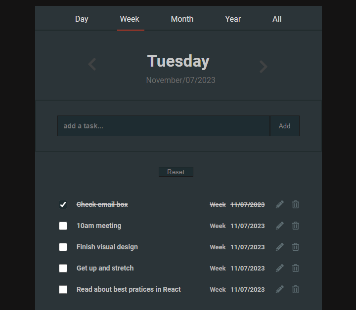

  # DWMY Tasks React + Vite

-  DWMY Tasks is a todo list application that allows you save, edit, delete and show a list of tasks by Day, Week, Month or Year using local storage web API as data base.

- In this project I was able to apply some knowledge adquired during more than one year of study HTML, CSS, JavaSript and React.

## Built using:
- [React.js](https://react.dev/) + [Vite](https://vitejs.dev/)
- [Moment.js](https://momentjs.com/)
- [React Icons](https://react-icons.github.io/react-icons/)

## 

## Features: 
+ Add task
+ Edit task
+ Complete task
+ Display tasks by date
+ Delete task
+ Reset list tasks

## Hooks:
+ UseState
+ useEffect
+ useRef

## Array Methods:
+ Map 
+ find
+ filter
+ Math

## More:
+ Conditional rendering
+ Conditional onClick
+ Conditional onSubmit
+ Conditional onChange
+ Component reusability
+ LocalStorage 
+ Moment.js library
+ React-icons pack
+ Style atribute change

## How to install:
- First clone this repository 
- Install dependeces. Make sure you already have node.js & npm installed in ypur system.
- You'll need to instal moment.js library and React-icons packs. 
- Run 'npm run dev' to serve at localhost:3000:.

## Usage:
- When the application starts, the "All" option will be set on an it will display a list with all tasks previously added.

- To add a new task, just select Day, Week, Month or Year on the nav bar, write a title of task into the text field input and click Add button.

- Each task has buttons to edit and delete it and a checkbox to mark as complete task.

- To edit task, just click in the pencil icon and it will display the title of the respective task in the the input text filed, rewrite or edit title and clik Add button.

- To delete a task, click on the trash icon of respective task.

## Fell free to create issues and contributions for features or bugs to this project.

